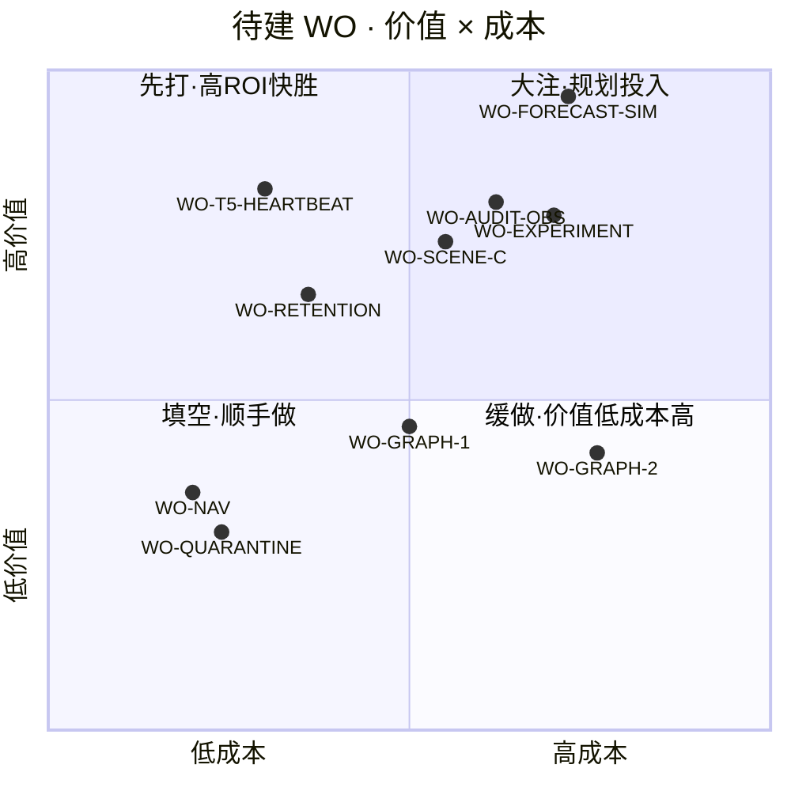

# 优先级 · 价值 × 成本四象限（待建 📐 WO 的 ROI 排序）

> 对**设计待建（📐）**的 WO 按"价值（对北极星/商业化/合规的解锁度）× 成本（dev 工作量/风险）"排 ROI，给可执行的**派发顺序**。已交付（✅）不在此列。
> 价值 H/M/L · 成本 S/M/L · 硬依赖大多已就绪（DM-keystone✅/M11✅/Scheduler✅/Outbox✅/SCENE-B✅）→ 多数**无前置阻塞**，纯 ROI 排序。

## §1 价值 × 成本 · 逐单评估

| WO | 价值 | 成本 | 风险 | ROI 判定 | 理由 |
|---|---|---|---|---|---|
| **WO-T5-LEASE-HEARTBEAT** | H | **S–M** | 低 | ⭐**先打** | 多实例正确（生产命门）；根因解**主要是缩租约+删 steal+改测**——简化为主、新增少 |
| **WO-RETENTION** | M–H | **S–M** | 低 | ⭐**先打** | 防爆库+合规留存；复用 `removeWhere`+Scheduler·新增一个 job+policy 表·边界清晰 |
| **WO-FORECAST-SIM** | **VH** | M–L | 中（动核心求解器 risk.ts） | 🎯**大注·最该投** | 态势感知地基·解锁"决策算得准"最后一环（Maven 灵魂=多源融合）；但触 deterministic 求解器需谨慎 |
| **WO-AUDIT-OBS** | H | M | 中（触多写路径） | 🎯**大注** | 合规 who-did-what（商业化签约门）+ 端到端排障；要包所有 admin 写路径 |
| **WO-EXPERIMENT** | H | M–L | 中（新契约+迁移+求解器路由） | 🎯**大注** | 决策自证闭环（成熟决策系统标志）；接 M11 参数版本·确定性分流 |
| **WO-SCENE-C** | H | M | 低（模板+门已在） | 🎯**大注·稳** | 每决策入口可接地·商业化"能用"广度；重复但有界·SCENE-B 模板+SCENE-D 门兜底 |
| **WO-GRAPH-1** | M | M | 低 | ◽**择机** | 渲染一致+降维护；纯重构无新能力·不阻塞别的 |
| **WO-GRAPH-2** | M | M–L | 中（依赖 GRAPH-1） | ⏸**缓做** | 图引擎重构·纯维护价值·依赖 1 先落 |
| **WO-NAV-DATA / SANDBOX** | L–M | **S** | 低 | ▫**填空·顺手** | IA 整洁/UX·改 ShellLayout nav 配置+测试·半天活 |
| **WO-QUARANTINE** | L–M | **S** | 低 | ▫**填空·顺手** | 诚实空态文案+可选真值演示·小改 |

## §2 四象限

## §3 推荐派发顺序（ROI + 依赖 + 风险）

**第一波 · 高 ROI 快胜（低成本撬高价值·并行可发）**
1. **WO-T5-LEASE-HEARTBEAT** —— 生产命门、改动小（缩租约+删 steal+改测）；先发因它是"已暴露问题的根因解"，欠债越早还越省。
2. **WO-RETENTION** —— 防爆库地板、复用既有原语；先立门（每增长表有留存策略）后续新表自动受约束。

**第二波 · 大注（最该投·价值最高·需规划）**
3. **WO-FORECAST-SIM** —— 北极星最该补的一环（态势真源驱动）；放第二波因触核心求解器、值得专注做透 + 我真跑复验。
4. **WO-AUDIT-OBS** —— 合规签约门 + 排障地基；与 RETENTION 同属"企业右半边"、可紧随。
5. **WO-EXPERIMENT** —— 决策自证闭环；依赖 M11 参数版本（已在）、确定性分流。

**第三波 · 铺开 + 速胜填空（并行）**
6. **WO-SCENE-C** —— 接地铺到 20+ 入口（模板+门已在·稳）。
7. **WO-NAV-* / WO-QUARANTINE** —— 顺手 UI/IA 速胜（半天活·随时插空）。
8. **WO-GRAPH-1 → 2** —— 图渲染融合（择机·纯维护价值·不阻塞别的·可最后）。

## §4 一句话取舍

- **要"决策更成熟"** → 先 **FORECAST-SIM**（态势）+ **EXPERIMENT**（自证）。
- **要"卖得出/审得过/运维得了"** → 先 **AUDIT-OBS** + **RETENTION** + （已剔除的 DR/DSR/预算硬阻断按需回补）。
- **要"扛得住生产"** → **T5-LEASE-HEARTBEAT** 立即。
- **低风险快胜随时插**：T5-HEARTBEAT / RETENTION / NAV / QUARANTINE。

## 诚实边界

- 价值/成本是**审核方架构判断**（非工时实测）；成本受 dev 对该子系统熟悉度影响。
- 价值排序锚"决策系统成熟度（算得准/接得地/扛得住）+ 商业化/合规解锁度"——**与你的商业优先级若不同，以你的为准**（如先攻某客户的合规清单则 AUDIT/DSR 上提）。
- 硬依赖已在图谱（`FEATURE-CATALOG-and-dependency-graph.md`）标注；本表只在无硬阻塞处排 ROI。

---
*审核方优先级分析（design+review·ROI 排序·价值/成本为架构判断非工时实测）· 仅推 `claude/vigilant-knuth-b1nmxn` · 模型标识不入任何提交物*
