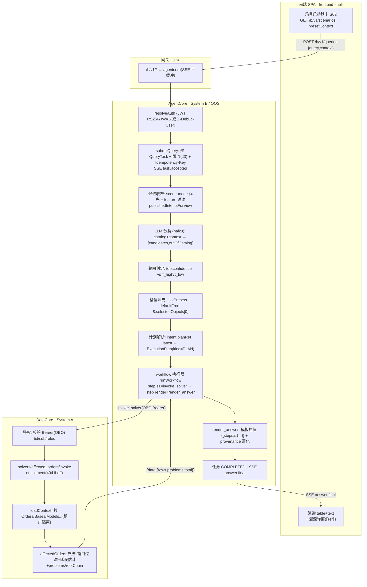

# 显微镜分析 · 一个推演场景的端到端全流程（S02 交期风险与受影响订单）

| 项 | 值 |
|---|---|
| 场景 | **S02**「常州基地影响哪些订单？」（视图 `risk`，意图 `affected_orders`，路径 A，风险级 COMPUTE） |
| 选它的原因 | 路径 A（声明式 workflow）确定性最强，能逐字节展示 IPO；同时跨两系统（AgentCore QOS + DataCore 求解器），把分类/路由/OBO 取数/求解/溯源/SSE 全链打穿 |
| 数据档 | L 档：**200 订单 / 12 基地 / 6 型号 / ~234 对象 / 90 天时序**（同 seed 字节级一致）；XL 档为 10⁴ 订单 |
| 口径 | 所有步骤、数据量、配置值均来自当前代码（标注 `文件:行` 或函数名），非示意 |

> 记法：每跳给 **I（输入）/ P（处理：做什么+怎么做）/ O（输出）/ 量（数据量级）/ 配（配置）/ 码（代码位置）**。

---

## 0. 配置快照（本次推演生效的全部配置）

| 配置 | 值 | 来源 |
|---|---|---|
| 分类器模型 | `claude-haiku-4-5`（用途绑定可覆盖为 `dcp:providerId:modelId`） | config.ts:11 / LlmSettings.roleModel |
| Agent 模型（本场景不用，路径 A） | `claude-opus-4-8` | config.ts:12 |
| 路由阈值 | τ_high=**0.85** / τ_low=**0.55**（场景包 thresholds 可覆盖） | config.ts:15-16 / orchestrator:229-230 |
| 求解超时 | 15s | config.ts:18 |
| OBO token 过期保护 | 剩余 <60s 拒绝新工具调用 | executor.ts:96-98 |
| 场景入口模式 | `risk` 视图的 SceneEntry.mode（缺省 WORKFLOW_FIRST） | orchestrator:166-167 |
| presetContext（场景启动器下发） | `{ targetView:"risk", selectedObjects:[{Base,changzhou,"常州"}], slotPresets:{baseId:"changzhou"} }` | scenarios-catalog.ts S02 |
| affected_orders 窗口 | [day−**7**, day+**14**]，delayDiv=8 | battery.ts:130-132 |

---

## 1. 端到端 DAG（模块 × 原子步骤）



ASCII 主链（一眼版）：
```
前端卡(presetContext) → 网关 → AC鉴权 → 建任务/SSE → 候选收窄 → LLM分类
 → 路由(τ) → 槽位 → 计划解析 → workflow[ invoke_solver →(OBO)→ DC[鉴权→loadContext→affectedOrders] → render_answer ]
 → 任务完成/SSE → 前端渲染+溯源
```

---

## 2. 逐跳 IPO（显微镜）

### Hop 0 · 前端场景启动器
- **I**：用户点 S02 卡。卡数据来自 `GET /b/v1/scenarios`（非前端硬编码）。
- **P**：读取该卡 `presetContext`，跳 `targetView=risk`、高亮选中对象、自动提交触发问句。
- **O**：`POST /b/v1/queries` body = `{ packageId, query:"常州基地影响哪些订单？", context:{ view:"risk", selectedObjects:[{objectType:"Base",objectId:"changzhou",label:"常州"}], filters:{}, conversationId } }`。
- **量**：1 次 GET（20 张卡 ~6KB JSON）+ 1 次 POST（body <1KB）。
- **配**：`view.scenarios` feature 开；卡 `willProduceDraft=false`（COMPUTE 类无草稿角标）。
- **码**：scenarios-catalog.ts、server.ts `GET /b/v1/scenarios`。

### Hop 1 · 网关 nginx
- **I/P/O**：`/b/v1/*` 反代到 agentcore（4002）；SSE 路径关闭缓冲（`proxy_buffering off`）。
- **配**：deploy/nginx.conf。**量**：透明转发。

### Hop 2 · AgentCore 鉴权（OBO 入口）
- **I**：请求头 `Authorization: Bearer <JWT>`（生产）或 `X-Debug-User: demo:planner:planner`（开发）。
- **P**：`resolveAuth` 验签——生产经 DataCore JWKS 验 RS256，取 claim `tid/sub/roles`；开发解析 debug 头。产出 `RequestAuth`（含 `token` 原值 + `tokenExpiresAt`，供下游 OBO 透传）。
- **O**：`RequestAuth{ tenantId:"demo", userId, roles:["planner"], token, tokenExpiresAt }`。
- **配**：JWKS `/a/v1/.well-known/jwks.json`。**码**：auth.ts。

### Hop 3 · QOS submitQuery（任务编排起点）
- **I**：`RequestAuth` + `SubmitQueryBody`。
- **P**：① 校验 `shell.query-dock` feature（关 → 404 不泄露）；② 校验 package 属本租户；③ 每用户**并发执行中任务 ≤3**（429 否则）；④ 可选 `Idempotency-Key` 去重；⑤ 建 `QueryTask{status:ROUTING}` 落库；⑥ **§13.2 代次取消**：同 conversationId 在执行旧任务默认取消（SUPERSEDED）；⑦ 发 SSE `task.accepted`；⑧ `setImmediate` 异步跑 pipeline。
- **O**：`{taskId, status:"ROUTING", streamUrl:"/b/v1/queries/{id}/events"}`；前端据此开 SSE。
- **量**：1 行 task；1 SSE 事件。
- **码**：orchestrator.ts:104-157。

### Hop 4 · 候选收窄（分类前的"缩圈"）
- **I**：task、package、`enabledFeatures`（功能开通集）。
- **P**：场景入口模式优先（AGENT_FIRST/ONLY 直接走 agent）；否则 `publishedIntentsForView(packageId, "risk", enabledFeatures)` 取该视图下 **PUBLISHED** 意图，并**剔除绑定到已关闭 feature 的意图**（候选与分类目录一致地收窄）。
- **O**：候选意图集（risk 视图 ~6 个：affected_orders / risk_root_cause / adopt_mitigation / kit_analysis / yield_diag / maint_stagger）。
- **量**：内存过滤；候选 ≤ 视图意图数。
- **码**：orchestrator.ts:182-185 / publishedIntentsForView:278。

### Hop 5 · LLM 分类（唯一的 LLM 调用）
- **I**：`{ query, 候选 catalog（key+描述+示例+槽位）, contextSummary(view+selectedObjects), historySummary(最近6轮) }`。
- **P**：组 system+user 提示 → `llm.classify({model:haiku})`；**重试 ≤2**（SDK 重试之外）；observe 时延直方图；审计补 `{providerId,modelId}`。多供应商：若模型无原生结构化输出 → JSON-mode 降级 + zod 校验重试。
- **O**：`{ candidates:[{intentKey:"affected_orders",confidence:0.95}], outOfCatalog:false, extractedSlots:{baseName:"常州"}, latencyMs, model }`。
- **量**：**1 次 LLM 调用**；输入 prompt ~数百 token（catalog+context），输出 JSON ~50 token。**（mock 模式下为脚本桩，真分需接真 key — 见评测框架 E4）**
- **配**：model 解析序：场景包 classifierModel → 租户用途绑定 → env 默认 haiku。
- **码**：orchestrator.ts:299-334。

### Hop 6 · 路由判定（确定性阈值）
- **I**：分类结果 + τ_high=0.85 / τ_low=0.55。
- **P**：`outOfCatalog || top.confidence<τ_low` → 路径 B（agent 兜底）；`<τ_high` → 中置信 → INTENT_CHOICE 澄清；`≥τ_high` → 高置信 → 路径 A。本例 0.95 ≥ 0.85 → **路径 A**。
- **O**：决策=路径 A，intent=affected_orders。
- **码**：orchestrator.ts:229-275。

### Hop 7 · 槽位填充
- **I**：意图 slotDefs + `extractedSlots` + presetContext.slotPresets + `selectedObjects`。
- **P**：合并优先序：显式槽 > slotPresets > `defaultFrom:$.selectedObjects[0]`（objectRef 类槽自动取选中对象）。缺必填槽 → SLOT_FILLING 澄清（≤2 轮）。本例 `baseId` 由 selectedObjects[0]=changzhou 自动满足。
- **O**：`slots={ baseId:"changzhou" }`（齐全，无澄清）。
- **码**：router/slots.ts、orchestrator 槽位流程。

### Hop 8 · 计划解析（引用模式 latest）
- **I**：intent.planRef `{planKey, version:"latest"}`。
- **P**：`resolvePlanForIntent` 解析到当前 PUBLISHED 最新版 ExecutionPlan（kind=PLAN）；**留痕 resolvedRefs**（"当时生效"版本）。
- **O**：`ExecutionPlan{ steps:[ {id:s1,type:invoke_solver,params:{solverKey:"affected_orders",args:{baseId:"{{slots.baseId}}"}}}, {id:render,type:render_answer,params:{blocks:[table←{{steps.s1.output.data.rows}}, text]}} ] }`。
- **码**：orchestrator.ts:510-519、refs 解析。

### Hop 9 · workflow 执行 — step s1 = invoke_solver（跨系统 OBO）
- **I**：step.params 模板插值后 `{solverKey:"affected_orders", args:{baseId:"changzhou"}}`。task 置 `EXECUTING_WORKFLOW`，发 SSE `routing.completed` + `step.started`。
- **P**：执行器 `executor.run("invoke_solver", params, {timeoutMs:15000})`：**OBO 守卫**（token 剩余<60s 拒）；经 HTTP `POST /a/v1/solvers/affected_orders/invoke`，头带 `Authorization: Bearer <用户OBO token>`（B 永不用服务 token 代用户读数）。
- **O**：DataCore 返回（见 Hop 9a），执行器记 ToolCallRow（toolName/input/outputDigest/durationMs/outcome）。
- **量**：1 次跨服务 HTTP；1 行 tool_call 审计。
- **码**：workflow/executor.ts:108-160、tools/datacore-http.ts、executor.ts OBO 守卫:96。

### Hop 9a · DataCore 求解（affected_orders 原子算法）
- **I**：Bearer OBO + `{args:{baseId:"changzhou"}}`。
- **P**：① 鉴权校验 tid/sub/roles；② **entitlement**：`requireFeatureTag("solverKeys","affected_orders")`（功能关 → 404 FEATURE_NOT_FOUND）；③ `loadContext(tenantId)`：并行拉 **租户隔离**的 Orders(200)/Bases(12)/Models(6)/Lines/Processes/Segments/...（A6 行级过滤作用于 query_objects/resolveSlice/aggregate 读路径；solver 上下文按租户域加载）；④ `affectedOrders(c,{baseId,fromDay,toDay})`：对 base=changzhou 的订单按窗口 [day−7,day+14] 过滤，逐单算延误估计（delayDiv=8），归并 `problems[]`（4 类）+ `rootChain[]`（order→judgement→rootCause→remedy 层）。**确定性**（无时钟/随机）。
- **O**：`{ data:{ baseId, affected:[...], total, fallback, problems:[...], rows:[...] }, snapshotVersion:"{ov}.{epoch}" }`。
- **量**：扫 200 订单 → 过滤出常州相关 N 单（典型十几单）；输出 rows ≤ N。
- **码**：app.ts `/a/v1/solvers/:key/invoke`、ontology.invokeSolver、solvers/risk.ts:275 affectedOrders。

### Hop 10 · render_answer（答案组装 + 溯源富化）
- **I**：step s1 输出 + render blocks 模板。
- **P**：模板插值 `{{steps.s1.output.data.rows}}` 填入 table block；text block 填结论；**provenance 富化** `enrichProvenance`——每个数字挂 `⟦ref:N⟧` 指向 `{toolCallId, outputPath}`（VERIFIED_WORKFLOW 信任级）；render_answer 必为末步（发布校验保证）。
- **O**：`Answer{ blocks:[table,text], provenance:[{toolCallId,outputPath}], trustLevel:"VERIFIED_WORKFLOW" }`。
- **码**：workflow/executor.ts render 分支、tools/provenance.ts。

### Hop 11 · 任务完成 + SSE
- **P**：task 置 `COMPLETED`，写 answer + resolvedRefs；发 SSE `answer.final`；指标 `qos_tasks_total{path:WORKFLOW,status:COMPLETED}++`。
- **O**：终态 task；SSE 事件流（task.accepted→routing.completed→step.started→step.completed→answer.final）。
- **码**：orchestrator.ts:554-561。

### Hop 12 · 前端渲染
- **I**：SSE answer.final。
- **P**：TanStack Query 消费；renderer 按 block 类型渲染 table/text；点 ⟦ref⟧ 弹溯源（toolCallId→tool_call 详情→snapshotVersion）。
- **O**：用户看到「常州受影响订单表 + 窗口口径脚注 + 每个数字可溯源」。第一次点击到答案目标 ≤5s。
- **码**：frontend-shell renderer 分发。

---

## 3. 原子功能清单（按模块）

| 模块 | 原子功能（本场景触发的） |
|---|---|
| 前端 | 场景卡下发、presetContext 注入、SSE 订阅、block 渲染器、溯源弹窗 |
| 网关 | 路径路由、SSE 不缓冲透传 |
| QOS 编排 | 鉴权、建任务、并发限流、幂等去重、代次取消、候选收窄、LLM 分类、阈值路由、澄清(本例跳过)、槽位填充、计划解析(latest)、workflow 执行、SSE 发射、指标 |
| workflow 执行器 | 步骤分发、模板插值 `{{slots/steps}}`、OBO 守卫、工具调用、provenance 富化、发布校验(前向引用/末步/环检测) |
| DataCore | OBO 验签、entitlement 门禁、租户隔离 loadContext、A6 行级过滤(读路径)、affected_orders 求解、snapshotVersion 快照戳 |

---

## 4. 数据量汇总（L 档；XL 档括注）

| 环节 | 数据量 |
|---|---|
| 候选意图 | ~6（risk 视图） |
| LLM 分类调用 | 1 次，prompt ~数百 token / 输出 ~50 token |
| 跨服务 HTTP | 1 次（invoke_solver） |
| 求解器扫描 | 200 订单（XL: 10000）+ 12 基地 + 6 型号 |
| 求解器输出 | 常州相关订单 ~十几单 + problems/rootChain |
| SSE 事件 | 5 个（accepted→routing→step.started→step.completed→answer.final） |
| 审计落库 | 1 task + 1 tool_call + N events |
| 端到端时延 | 路径 A 主成本=1 次分类 LLM + 1 次本地求解（mock LLM 下亚秒级；真模型下分类 ~数百 ms） |

---

## 5. 关键工程纪律（本链路体现的）
- **数字必溯源**：答案每个数字 ⟦ref⟧→toolCall→snapshotVersion，无裸数字。
- **OBO 而非服务代用户**：B 用用户 JWT 透传读 A 的数据，行级权限贯穿。
- **确定性**：同 (seed,args) 求解字节级一致；同 seed 数据字节级一致。
- **功能开通先于鉴权**：关掉的能力 404 不泄露存在性。
- **写降级**：本场景是 COMPUTE 只读；若是 S06 采纳类，create_action_draft 只产草稿、绝不直写真值（经审批）。

---

## 6. 诚实边界（显微镜下也要说清）
- **LLM 当前 mock**：Hop 5 的分类在 CI/无 key 时是脚本桩，**置信度/槽位是脚本给的**，不代表真实模型质量；评测框架（E4）已就绪，接真 key 即出真分。
- **行级过滤**：A6 严格作用于 query_objects/resolveSlice/aggregate；affected_orders 经 invoke_solver 走租户隔离上下文（若需逐单行级，应改走 query_objects 喂 visibleOrders —— 这是可选强化项）。
- **聚合下推**：若该场景改用 aggregate，当前 load-then-count 上限 1000（E2 转换引擎范围）。
