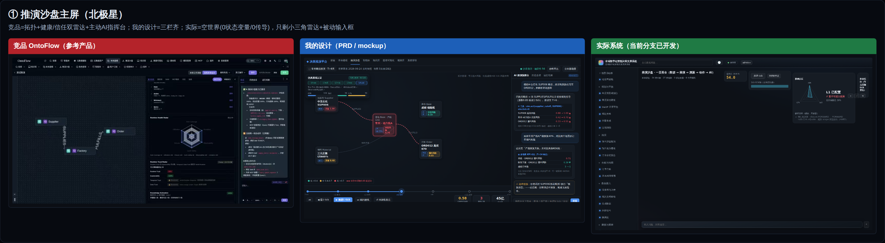
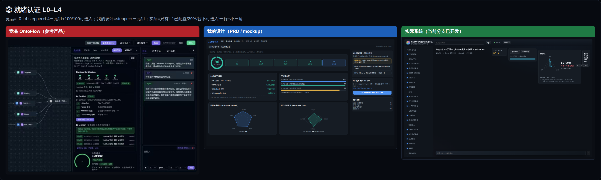
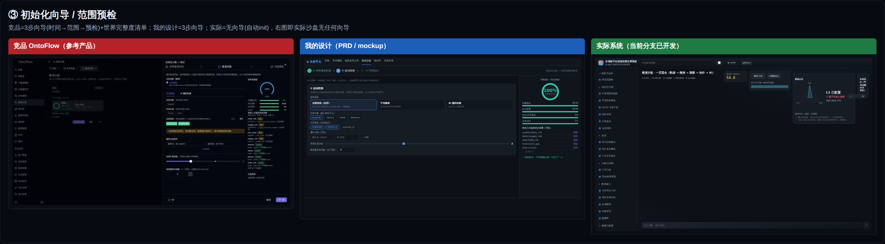
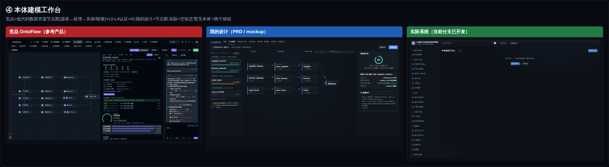
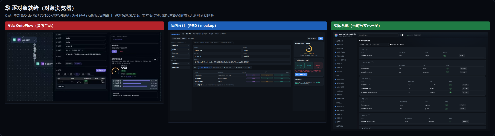

# 推演沙盘 UI 设计对齐审计 + 评审更正（两轴 · 诚实复盘）

> 由来：用户两次点出我评审漏了 UI 设计对齐（节点图 / 域管理），追问"§5 之前的评审是否也有问题、是否不止节点图缺失"。我派 3 个 agent 做**两轴审计**——对照**我的 5 张设计 mockup（sandbox/modeling/entity/readiness/init）+ 竞品 7 张真图 + 当前实现代码**。
> 结论：**我的评审有系统性漏判，且我的设计本身也有遗漏。本文如实记录、更正我之前的判定，并修我的评审协议。** 这是审核职责内我该做却一直没做的那一维。

---

## 0. 评审更正（我先认错 · 撤回/降级我之前的判定）

| 我之前判定 | 实情（审计核出） | 更正 |
|---|---|---|
| **"G-11 全闭（增量 0-4 完整）"** | 沙盘 UI 缺**北极星核心**（分支→对比 UI）+ **R4 红线**（采纳→Action）+ 初始化向导 + AI 指挥台 + ~70% 就绪面板元素 | **撤回"全闭"** → G-11 应为 **◐（后端齐，UI ~30-40%）** |
| **增量 4 UI "✅ 可合"** | UI 仅实现我设计的 ~30-40%；门B 我只验了"渲染了诚实数据"，没核"设计元素是否齐" | **更正为 🔴 应打回**（至少 R4 采纳缺 + 分支/对比 UI 缺，红线级） |
| **增量 2 就绪认证 "✅ 可合"** | 就绪面板只渲染 3/10 设计元素（L0-L4 stepper / L4三元组 / Trial Tick / scope 切换 / gauge / entering 全缺；后端 `deriveCertification` 都算了） | **更正为 ◐**（数据契约齐，前端"七荒地"） |

**根因（我的方法缺陷）**：我把"评审"做成了"功能验收"（门绿 + happy-path 渲染了诚实数据就放行），**从没做"对照设计 mockup + 竞品逐元素核对"**。这系统性影响我所有 UI 相关评审，不止 §5/增量 4。

---

## 1. 轴 1：我的设计 vs 竞品 —— **我 PRD 自己漏了什么（设计盲区）**

| 竞品元素（来源） | 我设计（mockup/PRD） | 严重度 |
|---|---|---|
| **健康雷达 6 维**（image1：Rule Coverage/Utilization/Closure/Cycle Safety/Observability/Activation） | ❌ **SPEC 完全没设计**（我在 GROUNDING §F.1 **记过**却没设计进 SPEC） | 🔴 |
| **信任雷达 4 维**（image1：Runtime/Explainability/Temporal/Data Trust） | ❌ **SPEC 完全没设计**（把"信任"压进了 R13 溯源） | 🔴 |
| **AI 指挥台"主动提待办 + 自动生成查询代码"**（image1 右栏） | ⚠️ 我只设计了**被动问答**（QueryDock），无主动配置 | 🔴 |
| **逐对象（局部）就绪 75/100**（image5） | ❌ 我只设计全局 L0-L4，无逐对象面板 | 🔴 |
| **范围预检③ 将进入清单**（image7：变量38/38·规则4/4·Action7/7） | ⚠️ 提及但 mockup 未展开清单 UI 结构 | 🟡 |
| **L4 三元组 vs 我"三件套"口径**（image6 Fanout/Writeback/Observability） | ⚠️ 我用"派生/动作/查询"，口径与竞品不同，未显式映射 | 🟡 |
| **拓扑边 link label + 系数**（image1 `SUPPLIES 0.85`）/ tick 事件标记 | ⚠️ mockup 节点有、边无标注；时间轴无事件标记 | 🟡 |

> **轴 1 诚实结论**：我对标竞品时**只盯了 image6"全局认证屏"，漏了 image1"运行雷达"两块 + image5"逐对象"**——而这些我自己在 §F.1 记录过。我的设计完成度 vs 竞品 ≈ **70%**。

---

## 2. 轴 2：我的设计 vs 实现 —— **实现缺/走样什么（我评审漏判）**

| 我设计的元素 | 实现 `SandboxView.tsx` 状态 | 严重度 |
|---|---|---|
| **分支 / 多场景 KPI 对比 UI** | ❌ **完全缺**（后端 CLI 有 branch/compare，UI 无面板）——**北极星"分支→对比"断在 UI** | 🔴 |
| **采纳 → R4 Action 草稿** | ❌ **完全缺**（无采纳按钮）——沙盘模拟态没有"采纳才写真值"路，**违 RL4** | 🔴 |
| **初始化向导 UI（3 步：时间→范围→预检）** | ❌ 缺（仅后端 init() 逻辑，无向导 UX，自动生成 baseSnapshot） | 🔴 |
| **范围预检确认步** | ❌ 缺（无"世界完整度+清单"确认，自动跑进沙盘） | 🔴 |
| **AI 指挥台组件** | ❌ 缺（SandboxView 无右栏 AI） | 🔴 |
| **就绪面板**：L0-L4 stepper / L4三元组卡 / Trial Tick 卡 / 全局↔局部切换（写死 GLOBAL `:176`）/ 完整度 gauge / entering 清单 | ❌ **6 项全缺**（`cert.l4Checks`/`trialTick`/`entering` 数据都在，前端未渲染） | 🔴 |
| **已实现 ✓** | 配置驱动 / tick / 节点着色 / PmDag 拓扑 / 三维雷达 / gaps 清单 / canEnter 文字 / checkpoint(CLI) / HeatStrip | ✅ |
| **拓扑边 label+系数 / tick 事件标记 / 两行业 UI 证据** | ⚠️ 走样/缺证据 | 🟡 |

> **轴 2 诚实结论**：实现 = 我设计的 **~30-40%**。数据层+tick+拓扑+三维雷达+gaps 在；**分支对比/采纳/初始化向导/AI 指挥台/70% 就绪元素全缺**。**我 FDE 时只看到"渲染了诚实数据"，没核这些缺失——这是我评审盲区的铁证。**

---

## 3. 建模页族（Agent 1 补充，同一盲区）

- **ModelingPage**：缺左栏数据源面板 + 就绪面板（ARCH §4 要求）🔴；映射画布是文本非节点图 🟡。
- **ObjectTypesBrowserPage**：~~缺逐对象就绪%（竞品 image5）🔴~~ → **✅ 已补（轨A P1）**：每类型显就绪%（真后端三维算：字段绑定覆盖 R12 / provenance 锚 / 已物化，`GET …/object-types/stats` 加 `readiness/boundCount/sourceProps/hasBindings/materialized/estimated`）+ 域均就绪 + 展开见分解证据 + 缺数诚实标"估算"；零写死 R14 / 确定性 R6；FDE 实拍 `docs/evidence/trackA-p1-object-readiness-fde.png`。
- **数据管道 DAG**（源→处理→实体）：ModelingPage/DataBuilderPage 均缺，`PmDag`/`FdeGraph` 现成未复用 🔴/🟡。
- **SlicesPage**：文本表，无子图节点图 🟡。
- **R13 溯源**：SandboxView/RiskBoard KPI 无规则/源系统悬浮，`Provenance`/`RuleRef` 现成未用 🟡。
- **RiskBoardView**：缺采纳→Action 🔴。

---

## 3.5 实拍证据（真启动系统 · 非 mock · Playwright 三路对位）

> 方法：datacore 内存态 `SEED_DEMO=1` + `PUT /a/v1/tenants/demo/features` 开 `sim.*`（默认关→默认连入口都没有）+ 真登录 demo/admin + SPA 内导航实拍（在内存 token 下不能 reload，故用 pushState 客户端路由）。三路对位图（左竞品/中我的设计/右实拍）存 `docs/assets/sandbox-ui-audit/compare-{1沙盘,2认证,3向导,4建模,5逐对象}.png`：
>
> 
> 
> 
> 
> 

| 屏 | 竞品 | 我的设计 | **实际实拍** |
|---|---|---|---|
| ① 沙盘主屏 | 拓扑+健康雷达6维+信任雷达4维+主动AI指挥台 | 三栏齐 | **空世界**：34类型/27链接派生但 **0 状态变量 · 0 传导规则**→画布无彩色节点；就绪只剩小三角(3维)+"L1/29%/暂不可进入"；底部仅被动输入框 |
| ② 就绪认证 | L0→L4 stepper+L4三元组+100/100环 | stepper+三元组 | 仅 **"L1已配置/29%/暂不可进入"一行**+小三角 |
| ③ 初始化向导 | 3步向导+世界完整度清单 | 3步向导 | **无向导**（挂载即自动 init 建会话） |
| ④ 本体建模 | 低代码数据管道节点图+L0-L4+AI | 数据管道节点图 | **空状态"暂无本体"**+两按钮 |
| ⑤ 逐对象就绪 | 单对象就绪75/100+三准备度分解 | 逐对象面板 | 文本表(类型/属性/主键/**物化数**)，无就绪% |

**实拍新增的、比静态审计更重的一条**：demo 租户沙盘是**空世界**——这是**两层叠加**缺口：
- **种子缺口（新）**：传导引擎（增量3）+ live-fire 是真过的，但那是**临时构造带规则的会话**；**demo 租户从没种过传导规则/状态变量**，所以默认沙盘没东西可推。→ HANDOFF 须加一项"给 demo 种 propagation rules + state vars，让沙盘开箱有内容"。
- **前端缺口（原审计）**：就算有数据，竞品/我设计的面板前端没砌。

**不抹杀的真实**：配置驱动派生真（34/27 来自本体非写死）；tick/检查点按钮在；就绪面板**诚实标"暂不可进入"**没假装能用；权限门/错误信封真。

---

## 4. 更正措施（我职责内：审核 + 改图纸，不写实现）

1. **本体 §8 G-11**：`全闭` → `◐（后端 0-4 齐，UI ~30-40%，列明缺口）`——本文同批回写。
2. **`SPEC-sandbox-readiness-certification`**：补**健康雷达 6 维 + 信任雷达 4 维**设计（我的设计 bug，轴 1 A.1/A.2）。
3. **缺口逐条记进 `HANDOFF §6.1`**，交开发 agent 补，按优先级：
   - **P0（红线/北极星）**：采纳→Action · 分支/对比 UI · 初始化向导+范围预检 · 就绪面板砌齐（stepper/三元组/Trial Tick/scope/gauge/entering） · **给 demo 租户种传导规则+状态变量（否则沙盘开箱空世界，实拍证据 §3.5）**。
   - **P1**：健康/信任雷达 · ModelingPage 数据源+就绪面板 · ~~逐对象就绪%~~（✅ 已补·轨A P1，§3 ObjectTypesBrowserPage） · 数据管道 DAG · R13 溯源悬浮。
4. **修 `HANDOFF §5` 评审协议**：UI 增量**强制两轴核对**——轴 1（竞品 §F 逐元素）+ 轴 2（设计 mockup 逐元素是否实现），不再只验功能。新增评审项 **⑩ UI 设计对齐**。

---

## 5. 一句话

**审计坐实了用户两问：① §5 之前的评审同样有问题——我系统性地"验功能不验设计完整性"；② 缺的远不止节点图——分支对比/采纳(R4)/初始化向导/AI 指挥台/2 张雷达/70% 就绪元素/建模数据源面板…… 一长串，且部分是我设计就漏了的。我撤回"G-11 全闭"与相关"✅可合"判定，更正为后端齐、UI 三四成，并据此修我的评审协议与设计。诚实定性：无架构分叉、数据契约齐，差的是"前端砌齐 + 我评审该两轴核对"。**
