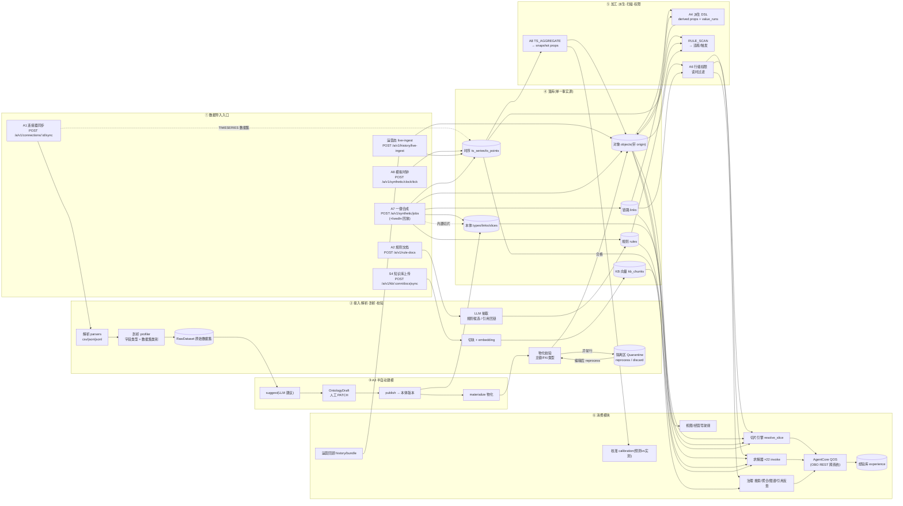

# Data Builder Pipeline · 数据构建管线节点图

> 范围：DataCore(System A)的数据全生命周期——**导入入口 → 接入/校验 → 落库 → 加工/派生 → 治理/权限 → 消费模块**。
> 所有节点都标了真实端点/服务，便于对照代码。

## 节点图（Mermaid，多数 Markdown 查看器/GitHub/VS Code 可直接渲染）



## 七个导入入口（节点①）一览

| 入口 | 端点 | 进什么 | 产物落到 |
|---|---|---|---|
| **A7 一键合成** | `POST /a/v1/synthetic/jobs` | 行业模板 + seed/scale | 直发 本体/对象/链路/时序/规则/内置切片(+livedIn 回放写 lived_in_states) |
| **A1 连接器同步** | `POST /a/v1/connections`→`/:id/sync` | 外部数据源行 | 解析→剖析→**RawDataset**；TIMESERIES 类直走 ts 写入 |
| **A2 规则文档** | `POST /a/v1/rule-docs` | 规则文档(分段) | LLM 抽取→规则候选→发布→**rules**(带原文引用回链) |
| **A3 半自动建模** | `/modeling/suggest`→`/publish`→`/materialize` | RawDataset | LLM 建议→人工 PATCH→发布本体→物化→**objects**(异常行入隔离区) |
| **S4 知识库** | `POST /a/v1/kb/:conn/docs`/`sync` | 文档 | 切块+embedding→**kb_chunks**(向量) |
| **A8 时序/模拟时钟** | `/timeseries/aggregate`、`/synthetic/clock/tick` | 时序点/仿真事件 | **ts_series/ts_points**→聚合→snapshot 属性 |
| **运营态 live-ingest** | `POST /a/v1/history/live-ingest` | 真实数据回填 | 覆盖合成水印，写 ts + objects + lived_in_states |

## 关键加工环节（节点⑤）

- **A4 派生 DSL**：对象/链路 → 派生属性(如 Base.committedQty、Model.totalDemand)，留痕 `derivation_value_runs`(输入→值)。
- **A8 TS_AGGREGATE**：ts 点 → 快照属性(如 Equipment.oee_current、Process.yield_baseline) → 再喂 A4 派生。
- **RULE_SCAN**：对象/时序/规则 → 违规与情景触发。
- **A6 行级权限**：所有"读"按角色 rowFilter 过滤(切片/求解器/治理同源)。

## 溯源贯穿全程

每条数据带 `origin`(SYNTHETIC/jobId 或 LIVE/connId)；切片/求解器结果带 `snapshotVersion = {本体版本}.{epoch}`；派生有 value_runs；规则候选有原文 sourceQuote 回链；隔离区行可编辑重处理。

## ASCII 兜底（终端可读）

```
[A7合成]┐                                   ┌→[切片]→┐
[A1连接器]→[解析]→[剖析]→(RawDataset)→[A3建模]→[发布本体]→[物化]→校验→(对象)─┤        │
[A2规则文档]→[LLM抽取]→(规则)                         校验异常→(隔离区)⇄编辑   │        ├→[QOS]→(经验库)
[S4知识库]→[切块+向量]→(kb_chunks)                                          ├→[求解器×22]→┤
[A8时钟/时序]→(时序)→[TS聚合]→快照属性─┐                                    └→[治理/视图]┘
[live-ingest]→(时序/对象/lived_in)     ├→[A4派生]→(对象富化)
(对象/链路)───────────────────────────┘→[RULE_SCAN]→违规   (读)→[A6行级权限]→消费
```
