# 功能清单（新增/加强）· 价值 · 依赖图谱

> 相对"目前系统基线"，本会话**已交付核发**（✅·附真跑证据）+ **已设计待建**（📐·施工单就绪）的功能全集、各自价值、与彼此依赖。状态：✅ 真跑核发闭合 / 📐 设计待派 dev / ⬡ 复用既有原语（基线已有）。

## §1 功能清单 + 价值

### A · 信任/诚实层（hollow-data 冰山收口）
| 状态 | 功能 | 价值（解决什么） |
|---|---|---|
| ✅ | **WO-DM A0** dataMode 诚实位（audit_timeline+14 extended） | 求解器输出不再哈希/魔数**静默冒充真算**；UI 能区分真/估/混 |
| ✅ | **WO-DM keystone** 全 46 求解器 dataMode + `no-silent-mock` 门 | 诚实位**契约层强制、全族覆盖**；新增求解器漏诚实位则门红（防回潮） |
| ✅ | **F-DM-KS-1 修** default-LIVE→fail-safe PARTIAL + LIVE 白名单 | LIVE **名副其实**——只有零业务魔数者标"实测"，混合魔数降 PARTIAL |
| ✅ | **WO-SHARE17** shareDelta 同源（删 -17/-100 魔数） | 份额测算去魔数、逐步可溯源 |
| ✅ | **WO-AStar** 洛阳红接真受影响订单(SO-3470) | 红色预警点开有真订单 OR 诚实"mock 基线"面板，**禁裸"暂无数据"** |
| ✅ | **SopBalance 兜底徽章** ②需求三线/④财务示例标 PARTIAL | 示例数据喂 C15/18/21 规则裁决时**诚实标、禁凭空业务数** |

### B · 生产韧性
| 状态 | 功能 | 价值 |
|---|---|---|
| ✅ | **WO-P0-LOCK** PG execution_locks 写崩修 + 同类潜伏修 + 防复发门 | PG 生产部署**锁不崩**、多实例互斥真可用（真 PG live-fire 坐实） |
| ✅ | **WO-T5-RESUME-LEASE** 重启续跑 steal 陈旧锁 | 进程崩溃重启**不卡 60min**、doc 不永久卡 EXTRACTING |
| 📐 | **WO-T5-LEASE-HEARTBEAT** 短租约+心跳（根因解） | **多实例正确**——消解 steal-vs-mutex 张力（steal 退化为单实例可选优化） |
| ✅ | **GATE-B** gates 链全 4 包构建 | 本地门**复现前端/agentcore tsc-red**、CI/本地一致、不漏类型红 |

### C · 决策接地（人机对话）
| 状态 | 功能 | 价值 |
|---|---|---|
| ✅ | **WO-SCENE-A** 规划体检不拒答 | 开放问句不再"请换个问法"——回落 agent |
| ✅ | **WO-SCENE-B** 场景 agent `agt_plan_audit` + **真 Kimi 富答案** | 开放问句得**接地结构化答复**（真调 plan_audit 求解器+C15/16/18/21 裁决+管理事项+话术）——真 Kimi 实拍 654吨/15.92%/65分 |
| ✅ | **WO-SCENE-D 门** `scene-agent-config:check` | **防半截配置上架**（mode≠WORKFLOW_ONLY·defaultAgentId 已发布·工具规则合法） |
| 📐 | **WO-SCENE-C** 铺到 20+ 入口 | 每决策入口都能"就本页数据接地对话" |

### D · 数据管线（成熟化 D0）
| 状态 | 功能 | 价值 |
|---|---|---|
| ✅ | **WO-PIPE-INCR ①** 连接器 CDC delta-merge | 增量同步**非全量重灌**——按 pk upsert、未变行保留、水位推进、省带宽 |
| ✅ | **WO-PIPE-INCR ②** 调度自动增量 + DL9(sync→事件→派生重算) | 定时**自动续传**（各数据集自身水位）+ 同步数据**自动流入对象/派生**（不再孤岛·闭 DL9 真断链） |
| 📐 | **WO-FORECAST-SIM** 推演接销售预测真源 | 紧张度由**真需求−产能**派生（非哈希）——决策"态势感知"地基 |

### E · 运营/合规/商业化（企业 SaaS 右半边）
| 状态 | 功能 | 价值 |
|---|---|---|
| 📐 | **WO-EXPERIMENT** 决策 A/B 冠军-挑战者 | "改了参数怎么知道更好"——**决策自证闭环**（求解器参数版本受控分流测结果） |
| 📐 | **WO-RETENTION** 数据留存/TTL | 防 outbox/tasks/ts **无界增长爆库** + 合规留存上限 |
| 📐 | **WO-AUDIT-OBS** 统一 append-only 审计 + 跨服务 requestId | 合规 **who-did-what**（actor+前后值）+ 端到端**排障**追踪 |

### F · UI / IA
| 状态 | 功能 | 价值 |
|---|---|---|
| ✅ | **WO-CSS** InferenceDag 配色修 + `css-vars` 门 | 对比度可读 + 门防"用不存在 CSS 变量"回潮 |
| 📐 | **WO-GRAPH-1 / 2** 过程 DAG 共享组件 / 本体图谱引擎 | 四处 DAG 渲染**一致**、降重复维护 |
| 📐 | **WO-NAV-DATA / SANDBOX** 导航重组 | 源数据模块归一「数据」组、沙盘并入「推演」 |
| 📐 | **WO-QUARANTINE** 隔离区诚实空态文案 | "空"从"像坏了"变"诚实的好消息" |

## §2 依赖图谱

```mermaid
graph TD
  classDef done fill:#1f5132,stroke:#62BE77,color:#eaffea;
  classDef plan fill:#3a2f10,stroke:#caa23a,color:#fff5d6;
  classDef base fill:#23272e,stroke:#7a8290,color:#cfd6e0;

  GATEB["GATE-B 全4包构建门 ✅"]:::done

  subgraph TRUST["A · 信任/诚实层"]
    DMA0["WO-DM A0 dataMode ✅"]:::done
    DMKS["WO-DM keystone 全46+门 ✅"]:::done
    FDM["F-DM-KS-1 fail-safe白名单 ✅"]:::done
    SH17["WO-SHARE17 同源去魔数 ✅"]:::done
    ASTAR["WO-AStar 洛阳红接真订单 ✅"]:::done
    SOPB["SopBalance 兜底徽章 ✅"]:::done
    DMA0 --> DMKS --> FDM
    DMKS --> SOPB
  end

  subgraph RESIL["B · 生产韧性"]
    P0["WO-P0-LOCK PG锁修 ✅"]:::done
    T5["WO-T5-RESUME-LEASE 续跑steal ✅"]:::done
    T5HB["WO-T5-LEASE-HEARTBEAT 短租约心跳 📐"]:::plan
    P0 --> T5 --> T5HB
  end

  subgraph GROUND["C · 决策接地"]
    SCA["WO-SCENE-A 不拒答 ✅"]:::done
    SCB["WO-SCENE-B 场景agent+真Kimi ✅"]:::done
    SCD["WO-SCENE-D config门 ✅"]:::done
    SCC["WO-SCENE-C 铺开20+入口 📐"]:::plan
    SCA --> SCB --> SCC
    SCD --> SCC
  end

  subgraph PIPE["D · 数据管线"]
    P1["WO-PIPE-INCR① CDC delta-merge ✅"]:::done
    P2["WO-PIPE-INCR② 调度自增量+DL9 ✅"]:::done
    FC["WO-FORECAST-SIM 推演接真源 📐"]:::plan
    P1 --> P2
  end

  subgraph OPS["E · 运营/合规/商业化"]
    EXP["WO-EXPERIMENT 决策A/B 📐"]:::plan
    RET["WO-RETENTION 留存TTL 📐"]:::plan
    AUD["WO-AUDIT-OBS 审计+追踪 📐"]:::plan
  end

  subgraph UI["F · UI/IA"]
    CSS["WO-CSS 配色+门 ✅"]:::done
    G1["WO-GRAPH-1 DAG共享组件 📐"]:::plan
    G2["WO-GRAPH-2 图谱引擎 📐"]:::plan
    NAV["WO-NAV-* 导航重组 📐"]:::plan
    QU["WO-QUARANTINE 隔离区文案 📐"]:::plan
    CSS --> G1 --> G2
  end

  M11[("M11 校准·参数版本 已有")]:::base
  SCHED[("Scheduler 已有")]:::base
  OBX[("Outbox 已有")]:::base

  %% 跨域依赖（虚线=松依赖/数据流）
  GATEB -.构建地板.-> DMKS
  GATEB -.构建地板.-> P2
  DMKS -.dataMode契约.-> FC
  ASTAR --> FC
  P2 -.同步数据新鲜.-> FC
  M11 --> EXP
  DMKS -.metric诚实位.-> EXP
  SCHED --> RET
  OBX --> RET
  OBX --> AUD
  SCB -.真Kimi验证通道.-> SCC
```

## §3 关键依赖链解读（为何这么排施工序）

1. **诚实位链**：`DM-A0 → keystone → F-DM-KS-1`，且 keystone 是 **FORECAST-SIM / EXPERIMENT 的前置**（前者用 dataMode 标真源置信、后者用诚实 metric 评判两臂）——**信任地基先夯，态势与实验才可信**。
2. **韧性链**：`P0-LOCK → T5-RESUME（锁修好才暴露续跑被租约挡）→ T5-LEASE-HEARTBEAT（根因解）`——典型"修一个暴露下一个"，逐层逼近多实例正确。
3. **接地链**：`SCENE-A（不拒答）→ SCENE-B（接地·真 Kimi 证）→ SCENE-C（铺开）`，`SCENE-D 门`横向守 C 不半截上架。
4. **管线链**：`PIPE① delta-merge → PIPE② 自增量+DL9 事件→派生重算`，且 ② 的"同步数据自动流入派生"为 **FORECAST-SIM 喂真新鲜数据**（松依赖）。
5. **GATE-B 是横切地板**：所有"全 4 包构建"依赖它，否则 tsc-red 本地漏过（本会话亲历）。
6. **运营三件（E）复用既有原语**：EXPERIMENT 接 M11 参数版本、RETENTION 接 Scheduler、AUDIT 接 Outbox——**最小新增、接线为主**。

## §4 诚实边界

- 状态 ✅ 均**本会话真跑核发**（真 PG/真 Kimi/真服务/对抗撤回·见各 `REVIEW-*-closure.md`）；📐 为**设计待建**（施工单见 `DISPATCH-remaining-fused-worklist.md`）——未实装、价值是**预期价值**。
- 虚线依赖=**松依赖/数据流**（非硬编译依赖）；实线=**强前置**（前者不在、后者做不出或无意义）。
- 本图是**功能级**依赖（非代码 import 图）——反映"先做谁后做谁、谁的价值依赖谁先在"。

## 本体引用与影响

- 链路：诚实位链收口 **R13**；管线链接 **§4 DL9** + 数据→本体链；接地链收 **G-3**；韧性链涉执行锁/续跑语义。
- 📐 项落地时各自回写本体（新不变量 R-RETENTION/R-AUDIT、事件 experiment.concluded、门 3 道、断点 G-EXP/G-RET/G-AUD——详见 `DISPATCH-remaining-fused-worklist.md`）。

---
*审核方综合（design+review·✅真跑为据/📐设计待建·功能级依赖图）· 仅推 `claude/vigilant-knuth-b1nmxn` · 模型标识不入任何提交物*
